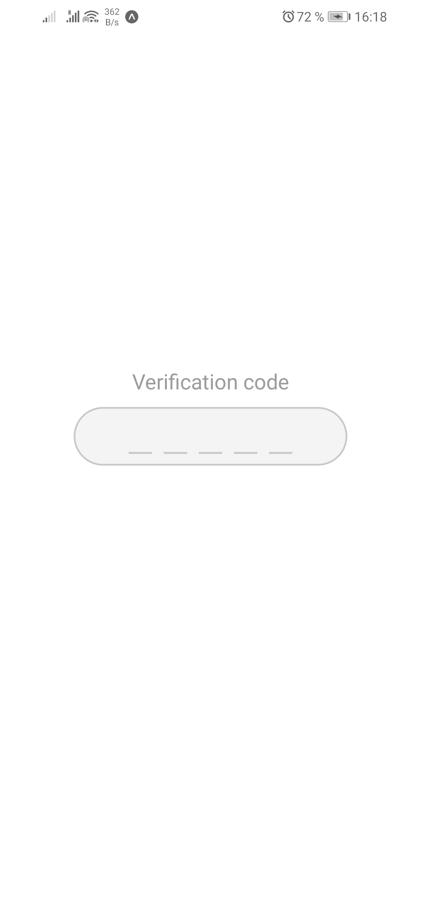
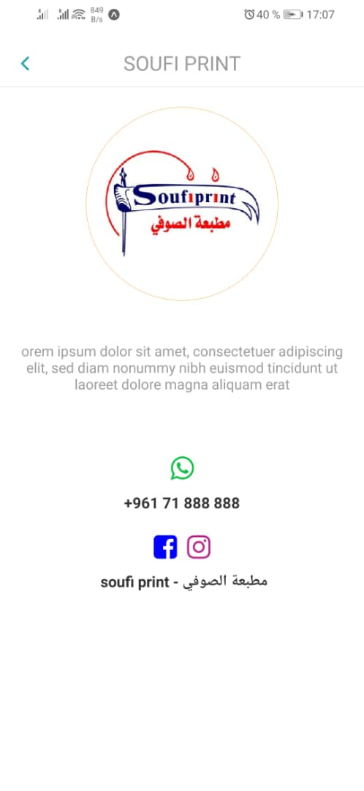

# Drivers Linking App - Tekram -

this repo represent my simple implementation with React native of a drivers linking app for a freelance job, this project can run on Android only (i didn't use expo because my analyze at the time showed that i need some custom functionality not implemented with expo).

The architecture proposed in this implementation can help new react native developers in understanding how the flow of screens and api events work, its not a perfect architecture, but a good and maintainable one.

## Folders Structure

this project is devised into multiple folders to allow code decomposition and architecture maintainability in the future. Globally, we can find two main folders:

- **Assets**
- **src**

In the Assets Folder we put our images and custom styles while in the src folder, our application code.

the source folder is composed of 11 sub-folders each containing a specific code, there are represented like so :

- **API folder :** containing api requests for multiple tasks (each task in its file like event requests in the EventApi file) ==> we can say that this folder is similar to the repository folder in an MVC architecture.
- **Components folder :** containing our react native components (that keeps repeating or that are not entire screens) .
- **Constants :** we put in this folder our app constants used in the project, like the axios Instance for exemple (its like the singleton pattern).
- **Navigation :** in any app, especially a react native app we need to handle Routes and navigations, this folder structure them and try to provide a simple interface to access some handlers of the root navigator.
- **screens :** this folder is self explanatory, each file represent a screen in the app that is routed with the configuration in the navigation folder above.
- **Actions :**  folder containing all redux actions devised into multiple files depending on their nature, especially for video call functionality.
- **Reducers :** folder containing all redux reducers in correspondence to their actions in the previous folder.
- **config/i18n :** folder containing our configuration to change app language depending on user needs.
- **helpers :** special helpers used for video and voice call functionality.
- **models :**  entities that we need to initialize from connectycube API to enable video and voice call.
- **services :** the same concept of services in an MVC architecture, when we delegate a certain treatment to a service before using its result in another place.

## How does the app look like ?

* **Auth :** 

|             Sign in              |             Sign up              |             code confirmation              |
| :------------------------------: | :------------------------------: | :----------------------------------------: |
|  | | |

* **Home :**

|                                 |                                 |
| ------------------------------- | ------------------------------- |
|||

* **profile :**

|          motorcycle info          |            driver info             |
| :-------------------------------: | :--------------------------------: |
|||

* **About Us :** 

* **Price List :** 

* **Sponsors :** 

* **Contact Us :** 

## How to run ? 

1. Prepare your environment by following the getting started [tutorial](https://reactnative.dev/docs/getting-started).
2. clone this repo, and go to the project root directory.
3. run yarn install.
4. run yarn start to run it on android (check package.json file).

------

For anyone interested with the project, feel free to contact me anytime in my email:

[fa_djellal@esi.dz]()
